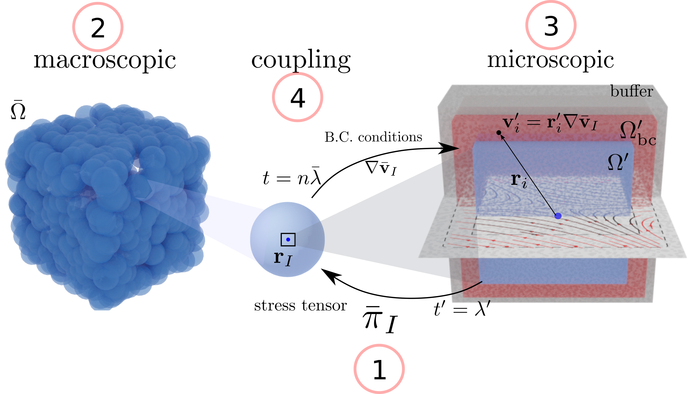

# LHMM
Fully Lagrangian Heterogeneous Multiscale Method implemented in LAMMPS 

## Description

A fully Lagrangian Heterogeneous Multiscale Method (LHMM) models the Navier-Stokes equations of complex fluids (polymers, suspensions, cells) without the need of constitutive equations. It considers that the momentum balance of a macroscopic system can be closed by directly solving microscales simulations, that provide the stresses on the fluid. 
    

## The Code
 LHMM is currently implemented using a C++ driver, that uses LAMMPS as a library to concurrently run macro and micro simulations. 

## Acknowledgments 

LHMM is being developed at The Basque Center for Applied Mathematics, as part of the [**ViBRheo**](https://vibrheo.bcamath.org/) project (**#101021893**), funded by the the European Commision under the H2020-MSCA-IF
